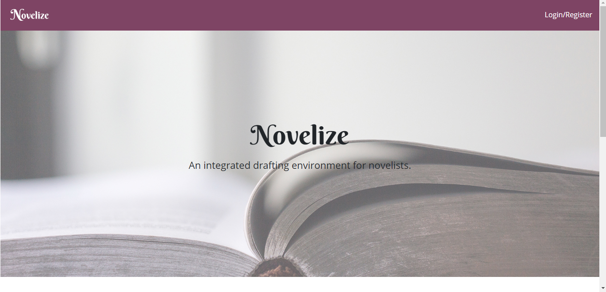
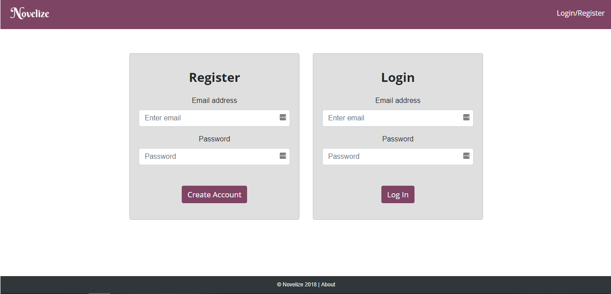
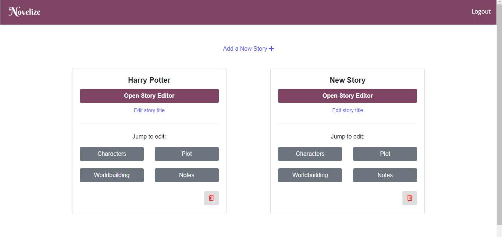
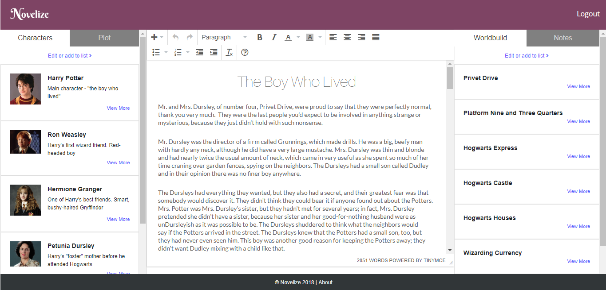
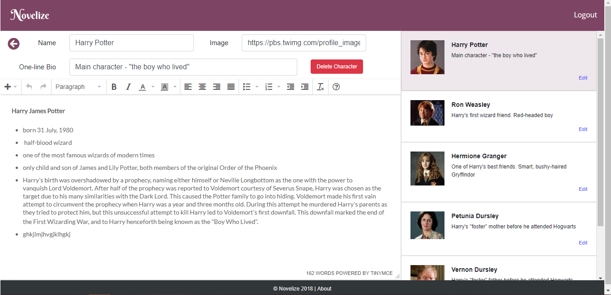
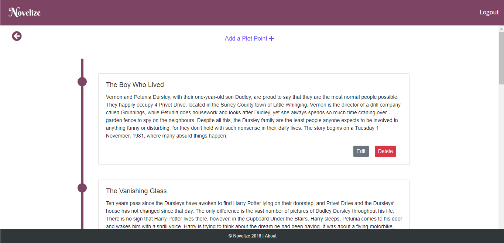
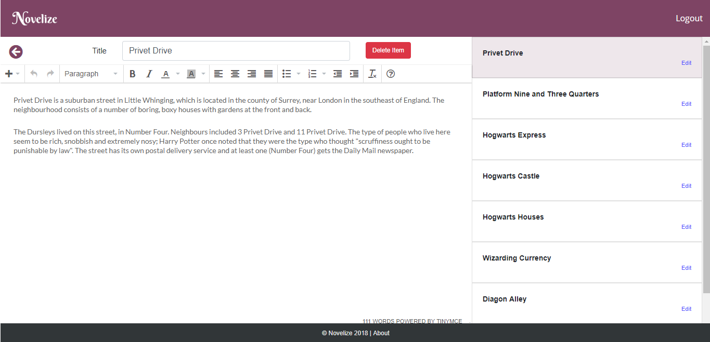
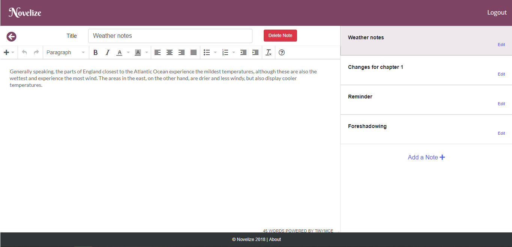

# Novelize

Novelize is a full-stack application created for writers in the process of drafting a novel. It was created to solve the problem of juggling multiple documents containing prose, character profiles, plot outlines, research notes, and worldbuilding systems. 

Novelize is a free, easy-to-use program with a clean and modern UI.

To test out the application, visit the link below. You can create your own account or use the test demo account:
* Email: user@test.com
* Password: password

If you choose to use the test demo account, please be respectful about the data that is preloaded.

https://novel-ize.herokuapp.com/

## Tech Stack
Novelize uses the following technologies:

* MySQL (using JawsDB as an online host)
* Express
* React
* Node
* Passport
* Heroku

## How to Use Novelize
* First, users must create an account
* Upon first login, users will be prompted to add a new story to their account
* They will then be able to open the main editing environment, or quick-jump to edit charaters, edit notes, edit plotline, or edit worldbuilding items. 
* Users are able to delete any of these items from their account.

## Novelize's Pages

* Home

    

* Login or Register

    

* User Dashboard

    

* Main Editor

    

* Character Edit

    

* Plot Edit

    

* Worldbuilding Edit

    

* Notes Edit

    

## How It Works
* Novelize utilizes React's stateful components and database calls to automatically update and save the user's writing. 
* Express hosts the site's API routes, and the rest of the pages are routed using the React Router.
* MySQL holds multiple associated tables that tie the user's data to their account.
* The drafting spaces use TinyMCE, an NPM plugin for editing text.
* The front-end design was created using Bootstrap.

## Future Development
Novelize is currently developing the following features:

* Ability to import and export stories and data
* Draft versioning and history
* Reorder plot items in the plot timeline
* Visually display where the user is in their plotline
* Send reminder emails to write
* Allow users to adjust their account settings
* Store session data in a more secure way
* Incorporate Google login as an authentication option
* Full mobile responsiveness